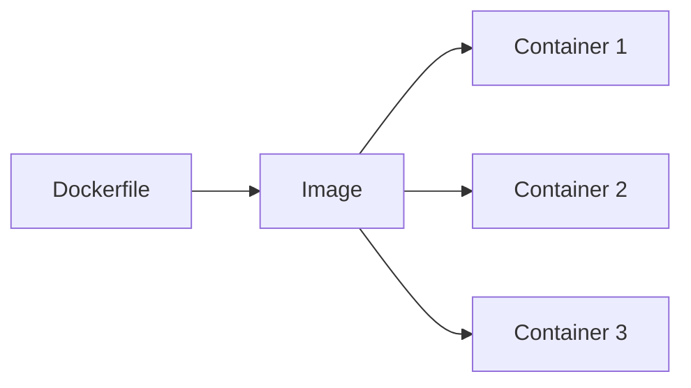

# はじめに

この記事を読み終えると、イメージとコンテナの違い、Dockerの役割、Dockerfileの基本がざっくり説明できるようになります。

3年目くらいまでに「これだけは押さえたい」コンテナ技術の要点を、ゆるっとまとめます。今回は概念の整理に絞って、トラブル対応の話は省きます。

# コンテナって結局なに？

コンテナはVMの軽量版じゃなくて、ホストのカーネルを共有しながらプロセスを隔離する仕組みです。

- cgroups: CPU/メモリ/IOの制限
- namespaces: プロセス、ネットワーク、ファイルシステムの隔離

「軽い理由」はこれ。

# イメージとコンテナの違い

- イメージ: 実行に必要なファイル一式（読み取り専用のレイヤー）
- コンテナ: イメージから起動した“動いてるプロセス”

同じイメージから何個も起動できる、って考え方が基本です。

# Dockerは「コンテナを扱うための道具」

Dockerはコンテナを作って動かすためのツール群です。ざっくり言うと、`docker build` でイメージを作って、`docker run` でコンテナを起動します。

- Docker Engine: 実際にコンテナを動かす本体
- Docker CLI: `docker` コマンドで操作するやつ

「コンテナという概念を、手元で簡単に使えるようにした道具」と覚えておけばおkです。

# Dockerfileは最低限ここだけ

まずはこれがわかればおkです。

- `FROM`: ベースイメージ
- `RUN`: ビルド時に実行するコマンド
- `COPY`/`ADD`: ファイルを取り込む
- `CMD`/`ENTRYPOINT`: 起動時のデフォルトコマンド

Dockerfileは「再現性のある手順書」だと思うと読みやすいです。

# まとめ

コンテナ技術は、細部より「概念の整理」が効きます。ここを押さえたら次はセキュリティやCI/CD、観測に進めばOKです。
