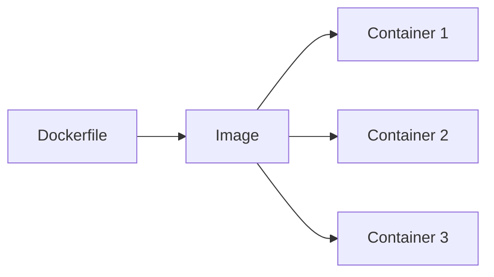

# はじめに

Dockerは、開発・運用の現場でほぼ当たり前に使われている技術です。  
ただし、

- 触ったことはあるけど、仕組みはよく分かっていない  
- イメージとコンテナの違いを言葉で説明できない  
- Dockerfileを書いている理由が曖昧  

という状態のまま使っている人も多いと思います。

この記事では、Dockerの基本を「概念整理」にフォーカスしてまとめます。  
細かいオプションやトラブルシューティングには踏み込まず、

- Dockerとは何か  
- コンテナとは何か  
- なぜこの仕組みが便利なのか  

を、イメージしやすい形で説明します。

---

# コンテナって結局なに？

コンテナは、アプリケーションを動かすための環境をひとまとめにした実行単位です。

アプリケーションだけでなく、

- 実行に必要なライブラリ  
- 設定ファイル  
- 起動コマンド  

まで含めてパッケージ化することで、  
「どこで動かしても同じように動く」ことを目指しています。

Dockerの文脈では、  
コンテナ = イメージから起動した実行中のプロセス  
と考えると整理しやすいです。

---

## OSとの関係

コンテナは、OS(Operating System)そのものではありません。

Linuxの機能（namespace / cgroup）を使って  
プロセスを分離して動かしている仕組みです。

そのため、

- 軽量  
- 起動が速い  
- 同時にたくさん起動できる  

という特徴があります。

---

## VMとの違い

よく比較されるのが VM(Virtual Machine) です。

- VM：OSごと仮想化する  
- コンテナ：OSは共有し、プロセスだけを分離する  

VMは「家を丸ごと借りる」イメージ。  
コンテナは「同じ建物の中で部屋を借りる」イメージです。

この違いが、  
コンテナの軽さや扱いやすさにつながっています。

---

# イメージとコンテナの違い

Dockerを理解する上で、最も重要なのが  
イメージとコンテナの違いです。

- イメージ
  アプリを動かすためのファイル一式  
  （読み取り専用・不変）

- コンテナ  
  イメージから起動した実行中のプロセス  
  （書き込み可能・状態を持つ）

同じイメージから、  
複数のコンテナを起動できます。

---

## 料理で例えると

- イメージ：料理のレシピ  
- コンテナ：実際に作った料理  

レシピは何度でも使えますが、  
料理は作った瞬間に状態を持ちます。

コンテナも同じで、起動後に生成されたログや一時ファイルは  
コンテナ固有の書き込みレイヤーに保存されます。

一方、イメージそのものは変化しません。

---

## 覚えておきたい整理

- イメージは再利用するもの  
- コンテナは使い捨て前提  
- 壊れたら作り直す  

この考え方が、Dockerを扱う上での基本になります。



# Dockerは何をするツール？

Dockerは、コンテナを作成・起動・管理するためのツール群です。

Dockerを使うことで、

- 環境構築を自動化できる  
- 実行環境をコードとして管理できる  
- 開発・検証・本番の差を小さくできる  

といったメリットがあります。

---

## Dockerの基本構成

最低限、次の2つを押さえれば十分です。

- Docker Engine  
  コンテナを実際に動かす本体

- Docker CLI  
  docker コマンドで操作するためのインターフェース

Dockerは  
「コンテナという仕組みを扱いやすくした道具」  
と考えると分かりやすいです。

---

# Dockerでアプリが動くまでの流れ

Dockerの基本的な流れは次の通りです。

1. Dockerfileを書く  
2. docker build でイメージを作る  
3. docker run でコンテナを起動する  
4. 必要に応じて docker stop で停止する  

重要なのは、  
**ビルド（イメージ作成）と実行（コンテナ起動）は別物**  
という点です。

---

# Dockerfileは何を書くもの？

Dockerfileは、イメージを作るための手順書です。

人が手作業で環境構築する代わりに、  
「この順番で、このコマンドを実行する」  
という手順をコードとして残します。

Dockerfileは、  
**再現性のある環境構築**を実現するためのものです。

---

## 基本の命令

よく使う命令は次の通りです。

- `FROM`: ベースとなるイメージを指定する
- `RUN`: イメージ作成時に実行するコマンド
- `COPY`/`ADD`: ファイルをイメージに取り込む
- `WORKDIR`: 作業ディレクトリを指定する
- `CMD / ENTRYPOINT`: コンテナ起動時に実行されるコマンド
---

## RUNとCMDの違い

混乱しやすいポイントです。

- `RUN`：イメージを作るときに実行  
- `CMD / ENTRYPOINT`：コンテナを起動したときに実行  

RUNでアプリを起動しても、  
コンテナ起動時には動きません。

---

# 具体例

Pythonの簡単なアプリを動かすDockerfileです。

```dockerfile
FROM python:3.12-slim
WORKDIR /app
COPY . .
CMD ["python", "app.py"]
```

ビルドと起動は以下の通りです。

```bash
docker build -t hello-app .
docker run --rm hello-app
```
# まとめ

Dockerを理解する上で大切なのは、  
細かい操作よりも**概念の整理**です。

- コンテナはOSではなくプロセス  
- イメージは設計図、コンテナは実体  
- Dockerはコンテナを扱うための道具  
- Dockerfileは再現性のある手順書  

この理解があれば、  
Dockerを使った開発や運用の話についていきやすくなります。

---

### 参照したインターネットソース

- https://docs.docker.com/
- https://docs.docker.com/reference/dockerfile/
- https://docs.docker.com/get-started/overview/