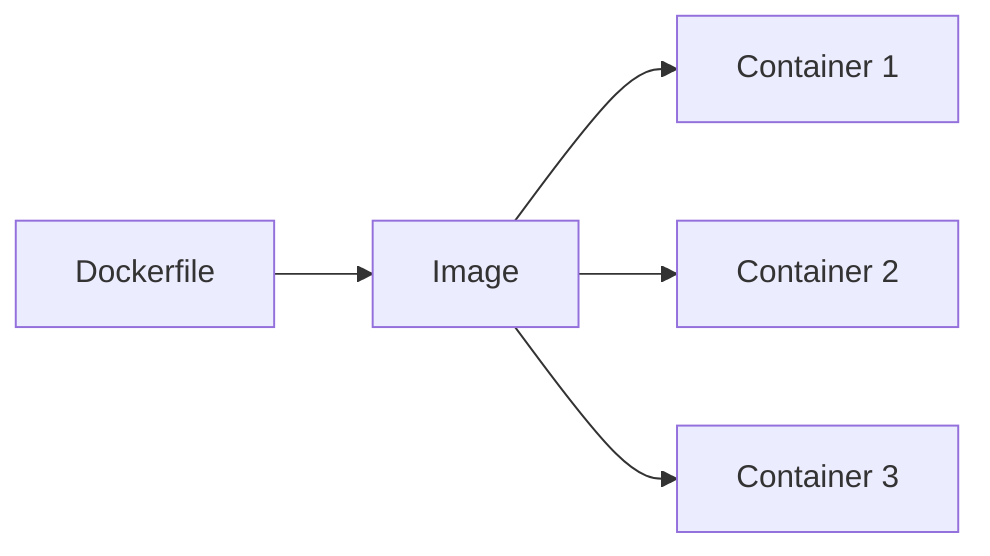

# はじめに

この記事を読み終えると、イメージとコンテナの違い、Dockerの役割、Dockerfileの基本がざっくり説明できるようになります。

3年目くらいまでに「これだけは押さえたい」コンテナ技術の要点を、ゆるっとまとめます。今回は概念の整理に絞って、トラブル対応の話は省きます。

# コンテナって結局なに？

コンテナはVMの軽量版じゃなくて、ホストのカーネルを共有しながらプロセスを隔離する仕組みです。

- cgroups: CPU/メモリ/IOの制限
- namespaces: プロセス、ネットワーク、ファイルシステムの隔離

「軽い理由」はこれ。

# イメージとコンテナの違い

- イメージ: 実行に必要なファイル一式（読み取り専用のレイヤー）
- コンテナ: イメージから起動した“動いてるプロセス”

同じイメージから何個も起動できる、って考え方が基本です。

もう少し噛み砕くと、イメージは「料理のレシピ」、コンテナは「実際に作った料理」みたいな関係です。レシピは保存して何度も使えるし、料理は作った瞬間に状態を持つ。コンテナは起動してからの変更（ログ、生成ファイルなど）が「書き込み可能なレイヤー」に溜まっていきます。逆にイメージ自体は不変なので、同じイメージから起動したコンテナは“土台”が同じになります。

よくある整理はこの2つ。

- イメージは使い捨てじゃない（再配布・再利用が前提）
- コンテナは使い捨てでOK（必要なら作り直せる）




# Dockerは「コンテナを扱うための道具」

Dockerはコンテナを作って動かすためのツール群です。ざっくり言うと、`docker build` でイメージを作って、`docker run` でコンテナを起動します。

- Docker Engine: 実際にコンテナを動かす本体
- Docker CLI: `docker` コマンドで操作するやつ

「コンテナという概念を、手元で簡単に使えるようにした道具」と覚えておけばおkです。

# Dockerで動くまでの流れ

ざっくりこの順番。

1. Dockerfileを書く
2. `docker build` でイメージを作る
3. `docker run` でコンテナを起動する
4. 必要なら `docker stop` で止める

# ちょい具体例（超ミニ）

Pythonの簡単なアプリを動かす例。

```dockerfile
FROM python:3.12-slim
WORKDIR /app
COPY . .
CMD ["python", "app.py"]
```

ビルドと起動はこんな感じ。

```bash
docker build -t hello-app .
docker run --rm hello-app
```

# Dockerfileは最低限ここだけ

まずはこれがわかればおkです。

- `FROM`: ベースイメージ
- `RUN`: ビルド時に実行するコマンド
- `COPY`/`ADD`: ファイルを取り込む
- `CMD`/`ENTRYPOINT`: 起動時のデフォルトコマンド

Dockerfileは「再現性のある手順書」だと思うと読みやすいです。

# まとめ

コンテナ技術は、細部より「概念の整理」が効きます。

- コンテナは「同じ建物で部屋を分ける」イメージ
- イメージはレシピ、コンテナは料理
- cgroupsは資源の上限、namespacesは見える世界の分離
- イメージは何度でも使える、コンテナは使い捨てでいい
- 同じイメージから複数コンテナを起動できる
- Dockerは工場設備で、`build` と `run` が基本動線
- Dockerfileは手順書で、順番が効く
- 迷ったら「固定したいのはイメージ／動くのはコンテナ」で整理
