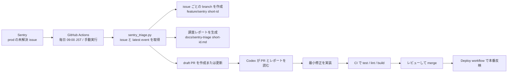
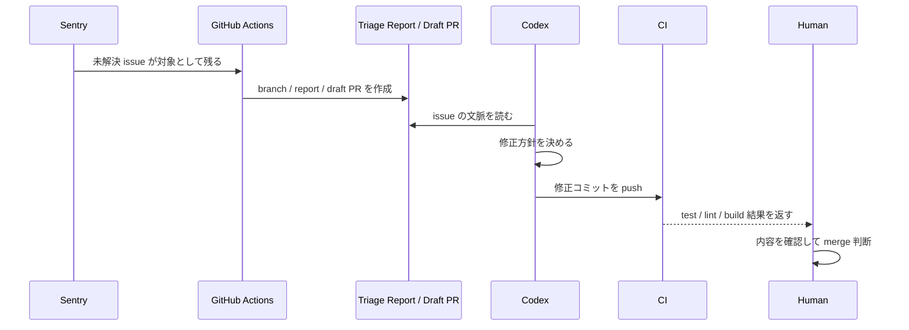

# はじめに

個人開発している backend で本番エラーが見つかったあとに、毎回同じ初動作業が発生していました。

- どの issue から手を付けるか決める
- 調査用の branch を切る
- 共有用の PR を作る
- 修正に必要な材料を集める

こういう部分は、人が毎回手でやるより、自動化したほうが速くて安定します。
そこで今は、**Sentry / GitHub Actions / Codex を組み合わせて、障害対応を自動化する仕組み**を個人開発で作ってみました。

この記事では、現在個人開発で実際に運用している構成をそのまま整理します。

---

# 先に全体像

今の流れを一枚で書くとこうです。



**Sentry が異常を見つけ、GitHub Actions が修正用の作業台を作り、その上で Codex が直しやすくする**
構成です。

---

# なぜこの形にしたか

本番エラー対応で重いのは、修正そのものよりも、修正に入るまでの段取りだったりします。

たとえば次のような作業です。

- Sentry で未解決 issue を探す
- 直近 event を開く
- branch 名を決める
- PR を作る
- 最初に何を見るべきかを文章に残す

このあたりは毎回かなり似ています。
だからこそ、自動化しやすいです。

一方で、

- この修正方針で本当に良いか
- 影響範囲はどこまでか
- deploy してよいか

のような判断は、まだ人間や Codex のレビューを挟みたいです。

なので個人開発では、
**収集・整理・着手準備までは自動化し、修正判断は人間と Codex に残す**
方針にしています。

---

# 1. Sentry 側の役割

まず、エラーの起点は Sentry です。
個人開発では backend と mobile の両方で Sentry を使っていますが、今の自動改善フローで対象にしているのは **backend の production issue** です。

backend 側では panic recovery や application error の capture を入れていて、本番で発生した異常を Sentry に集約しています。

---

# 2. GitHub Actions が毎日 issue を拾う

Sentry の issue 取得は GitHub Actions の workflow で回しています。
backend リポジトリには `Sentry Triage` workflow を置いていて、次のタイミングで動きます。

- 毎日 09:00 JST 相当
- `workflow_dispatch` による手動実行

やっていること自体はシンプルです。

1. backend リポジトリを checkout
2. Python をセットアップ
3. `SENTRY_AUTH_TOKEN` を確認
4. `scripts/sentry_triage.py` を実行

```yaml
on:
  schedule:
    - cron: '0 0 * * *'
  workflow_dispatch:
```

---

# 3. triage スクリプトがやっていること

中核は `scripts/sentry_triage.py` です。
このスクリプトは単に issue 一覧を取るだけではなく、**Codex がそのまま作業に入れる状態まで整える**役割を持っています。

## 3-1. issue ごとに branch を切る

未解決 issue を取得したら、`shortId` を使って branch を作ります。
形式は次のようなものです。

```text
feature/sentry/<short-id>
```

issue ごとに branch が分かれるので、

- 並列で修正しやすい
- PR の意図が分かりやすい
- 追跡や revert がしやすい

という利点があります。

---

## 3-2. 最新 event から調査レポートを作る

各 issue について、最新 event を追加で引いて Markdown の調査レポートを生成します。
保存先は次の形式です。

```text
docs/sentry-triage/<short-id>.md
```

レポートには次のような情報を入れています。


- issue の title / status / level / count
- first seen / last seen
- culprit
- latest event の timestamp / release / platform / logger
- event URL
- tags
- 次に見るべきこと

そうすることで、PR を見るCodexと私が
**最初にどこから見ればよいか**
をすぐに理解できるようにしています。

---

## 3-3. draft PR を自動で作る

レポートを書いたら、その branch を push して draft PR を作ります。
同じ branch の PR が既にあれば、新規作成ではなく更新させます。

ここで大事なのは、
**この PR は「直した」ことを示すのではなく、「この issue を直すための作業台ができた」ことを示す**
という点です。

だから draft PR にしていて、中には issue の要約と次のアクションを書いています。

この時点で、人間や Codex は

- どの issue を扱う PR なのか
- 何を見ればよいのか
- どの branch で直せばよいのか

をすぐ把握できます。

---

# 4. Codex に作業させる

このフローで Codex の役割は
**調査材料が揃った issue 専用 branch に対して、最小修正を素早く入れるところ**です。

Sentry の画面だけ渡して Codex に直させようとすると、前提共有のコストが高くなります。
でも今の構成なら、最初から

- issue 単位の branch
- 調査レポート
- draft PR
- 既存の CI

が揃っています。
そのため、Codex がかなり入りやすいです。



Codex に全部を丸投げするのではなく、
**GitHub Actions で前段を整地して、Codex が「読んで直す」に集中できるようにしている**
イメージです。

---

# 5. CI / Deploy まで含めて閉じる

修正したら終わりではなく、その後ろの流れもつないでいます。

backend には通常の CI workflow があり、PR に対して

- `go test ./... -v -race -coverprofile=coverage.out`
- `golangci-lint`
- `go build`

が走ります。

さらに `main` に merge されれば Deploy workflow が動き、

- migration 適用
- Fly.io への deploy

までつながります。

この構成にしておくと、Sentry から始まった issue 対応が
**検知 → 着手準備 → 修正 → 検証 → 本番反映**
まで一本の流れとして見えるようになります。

---

# この仕組みでよかったこと

実際に運用していてよかったのは、次の 4 点です。

## 1. 初動が速くなった

issue を見つけてから branch / PR / メモを用意するまでを自動化したので、修正をデプロイするまでがかなり短くなりました。

---

## 2. Codex に渡す文脈が安定した

Codex は強いですが、入力文脈がブレると修正品質も揺れます。
今は毎回ほぼ同じ形式の report と PR を用意しているので、Codex に渡す土台が安定しました。

---

## 3. issue ごとの作業が混ざりにくい

branch が issue 単位で分かれているので、複数の不具合対応が混線しにくくなりました。
これは人間にとっても、AI にとっても重要です。

---

## 4. 完全自動にしなかったのがよかった

自動化は全部つなぎたくなりますが、修正判断まで無人化するのはまだ怖いです。

今は

- 収集
- 整理
- branch 作成
- PR 作成

までを自動化し、最後の修正判断と merge 判断は人間側に残しています。
この分担が今の規模ではちょうどよかったです。

---


# まとめ

今回作成してみたのは

**Sentry が見つけた production issue を GitHub Actions が修正しやすい PR に変換し、その上で Codex が修正し、人間がレビューし、デプロイまでいける仕組み**
です。

まだまだ運用開始したところなので、この仕組みに改善点もあると思います
より良いフローなどあればぜひ教えてください。
